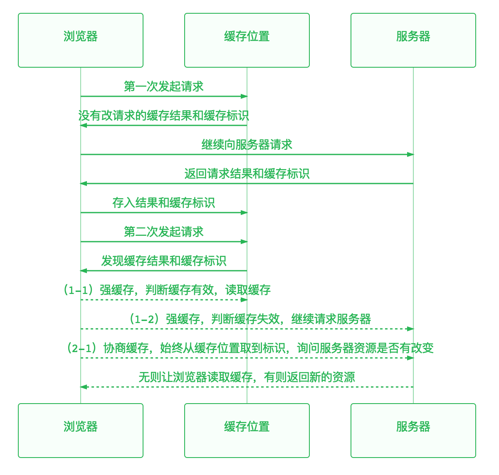

#### 浏览器缓存：
浏览器根据开发者制定的**缓存策略**，在向服务器请求资源的过程中，能够从**缓存位置**读取资源，以减少网络开销、提高用户体验。

#### 缓存位置

浏览器按以下顺序访问缓存位置：

* Service worker： 一个运行在浏览器背后的独立线程，相当于一个代理服务器，能够拦截请求，并缓存资源。 
* Memory Cache：资源小且读取频繁时，浏览器会选择将资源缓存于内存中。其读取效率更优。
* Disk Cache: 资源较大时或系统内存占用率较高时，浏览器会选择将资源缓存于硬盘中。其容量和存储时效更优。
* Push Cache：会话级别缓存，当session结束则被释放。

#### 缓存策略

在向服务器请求资源时，有以下缓存策略：

* 强缓存
* 协商缓存

第一次请求资源时返回的响应头中表述了该资源将遵循的缓存策略。具体过程为：

 

##### 强缓存
**1.首次请求资源时，若响应头中标注了expires或cache-control规则时，该资源遵循强缓存策略。**

**2.第二次请求资源时，若expires和cache-control未失效，则不会向服务器发送请求，直接从缓存位置中读取资源。**（此时控制台中显示200, from ** cache）

**3.若expires和cache-control已失效，则向服务器发出请求，得到新的资源和刷新标识。**(此时控制台中显示200并有具体size)

* expires:指定过期时间，在此时间前为缓存有效。（较旧）
* Cache-Control：其优先级比expires高。（较新）[查看具体规则](https://baike.baidu.com/item/Cache-control/1885913?fr=aladdin)

##### 协商缓存
**1.首次请求资源时，若响应头中标注了cache-control:no-cache且有lastModified或Etag，该资源遵循协商缓存策略。**

**2.第二次请求资源时，请求头中携带If-modified-since（值为上述的lastModified）或if-None-match（值为上述的Etag）,询问服务器资源是否发生改变：**

1. 是，服务器返回304和noneModified，浏览器读取缓存

2. 否，服务器返回200以及最新的资源和标识

* lastModified：文件的修改时间，服务器中文件若发生改变，该值也会改变。（较旧）
* Etag: 服务器生成的文件的唯一标识，服务器中文件若发生改变，该值也会改变。（较新）

#### 缓存机制

* 若开发者已制定了缓存策略，则强缓存优先于协商缓存执行，判断缓存失效时才向服务器请求最新资源。
* 若没有指定任何缓存策略，则浏览器会采用一个启发式的算法，通常会取响应头中的 Date 减去 Last-Modified 值的 10% 作为强缓存时间，在此段时间内二次发起请求通常会从内存中读取到缓存。

##### 参考：
[深入理解浏览器的缓存机制](https://www.jianshu.com/p/54cc04190252)

[浏览器缓存机制详解](https://blog.csdn.net/hhthwx/article/details/80152728)

##### 扩展阅读：
[Service Worker API _ MDN](https://developer.mozilla.org/zh-CN/docs/Web/API/Service_Worker_API)

[Service Worker 应用详解——志文工作室](https://lzw.me/a/pwa-service-worker.html)

[什么是CDN](https://www.zhihu.com/question/36514327?rf=37353035)

[关于CDN](https://www.zhihu.com/question/36514327?rf=37353035)