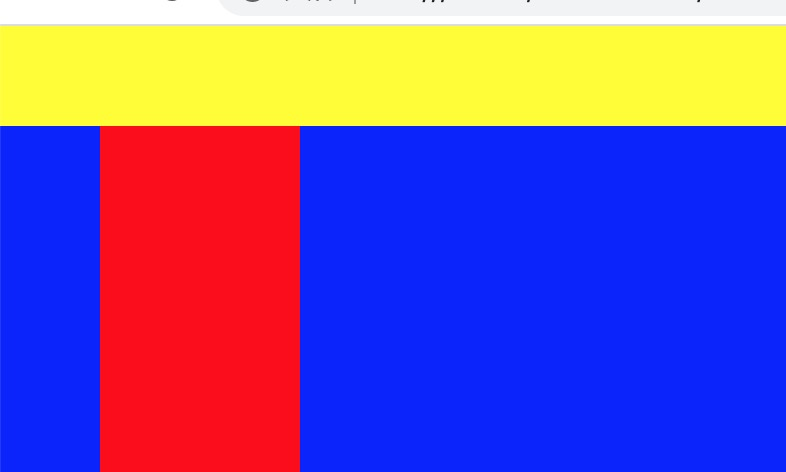

## 引出问题
子节点设置margin-top、magin-bottom会把margin转移给父节点，即父节点获得了这个margin并与其兄弟节点撑开了。

例如：
```css
.html{
  background-color: yellow;
    .body{
    background-color: blue;
      .react{
          background-color: red;
          width: 100px;
          height: 1000px;
          margin: 50px;
      }
    }
}
```
会表现为

黄色区域就是被撑开的50px，同理margin-bottom也会造成底部也撑开了50px;

## 解决方案

1. 尽量不在首个子元素的元素使用margin-top,不在最后一个子元素使用margin-bottom;
2. 给父元素一个0.1px的paading （最好的解决方案）
3. 父元素设置diplay: inline-block; （次好的方案）
4. 父元素设置absolute定位，或float:left（不推荐）

