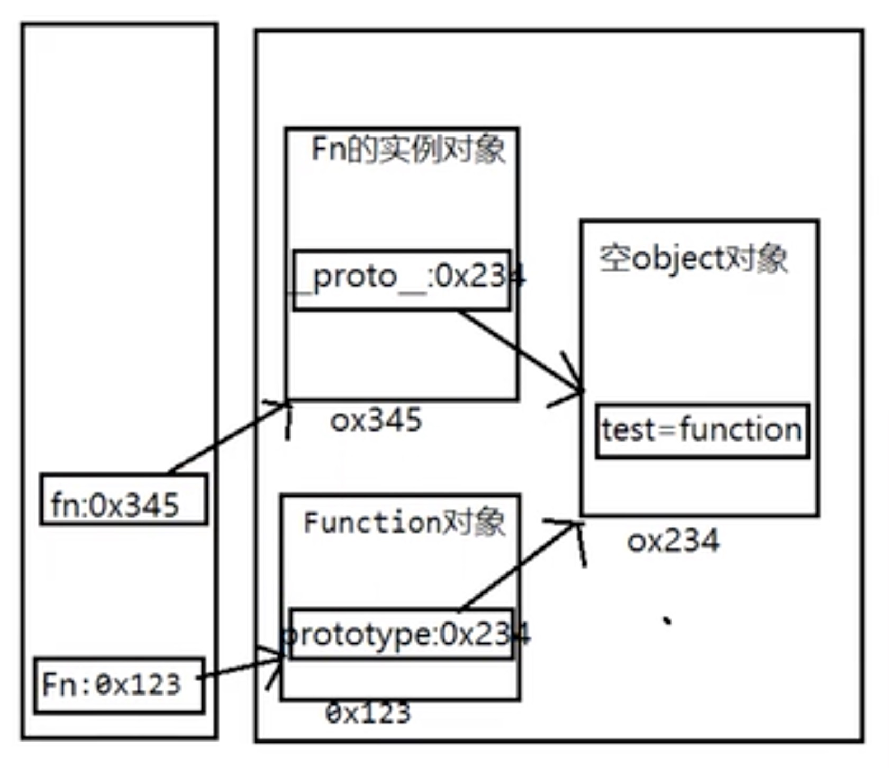
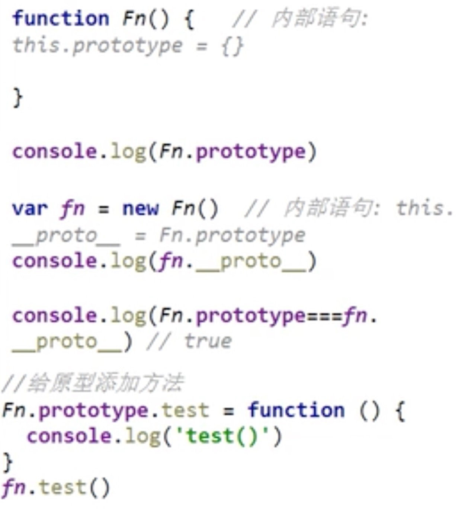
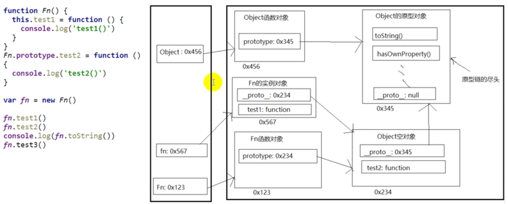
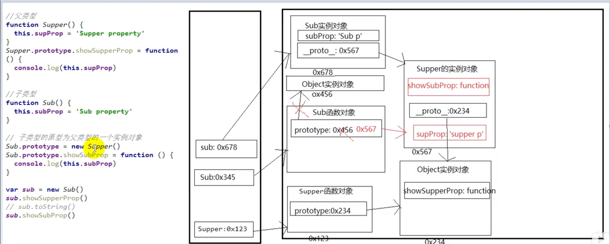
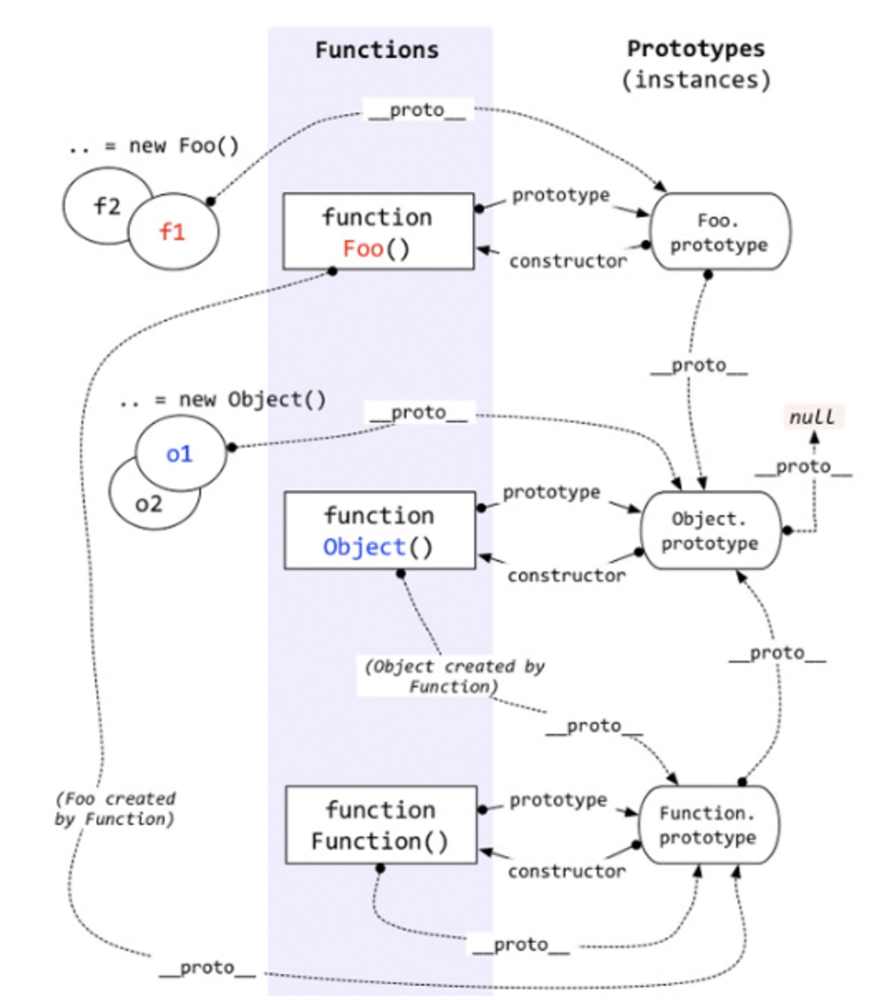

## 构造函数 实例对象 原型对象 三者的关系

* 构造函数：可以通过new 新建一个对象的函数
* 实例对象：new构造函数所新建的对象
* 原型对象：构造函数的prototype属性所指向对象

### 构造函数 与 实例对象 的关系

* 通过new构造函数可以新建一个实例对象
* new一个对象背后做了些什么
    * 创建一个空对象
    * 设置对象的__proto__属性，obj.__ proto__ = Fn.prototype
    * this指向空对象，并执行构造函数体
    * 返回这个对象

模拟实现new
```javascript
function Person(nickName, age){
    this.nickName = nickName;
    this.age = age
}

function newFunc(func, ...args){
    // 创建一个空对象，并设置__proto__属性
    const obj = {}; obj.__proto__ = func.prototype;
    // 以下两种方式相同效果
    // const obj = {}; Object.setPrototypeOf(obj,func.prototype);
    // const obj = Object.create(func.prototype);

    // this指向当前空对象，并执行构造函数
    const result = func.apply(obj, args);

    // 若构造函数return的结果为对象，则返回它
    // 否则返回obj
    return result instanceof Object ? result : obj;
}

const p = newFunc(Person, 'Alex', '22');
console.log(p);// Person { nickName:'Alex', age: '22' }
console.log(p.__proto__ === Person.prototype);// true
console.log(Object.getPrototypeOf(p));// Person
```

### 构造函数 与 原型对象 的关系
* 构造函数有一个prototype属性，指向原型对象（默认为Object空对象），如
`typeof Date.prototype === "object"`

* 原型对象中有一个constructor属性，他指向构造函数，如
`Date.prototype.constructor === Date // true`

（体现了一种相互引用的关系）

* * *

### 实例对象 与 原型对象 的关系

* 实例对象的__proto__属性，指向原型对象。


## 显式原型 与 隐式原型

* 构造函数的prototype属性（即显式原型）：在定义函数时自动添加，指向原型对象（默认为Object空对象）。
* 实例对象的__proto__属性（即隐式原型）：创建实例对象时自动添加的，如，同样指向构造函数所指向的原型对象

（例一）


* * *

### 隐式原型链
我们所说的"原型链"一般指隐式原型链，

每个对象都有一个__proto__属性，指向原型对象，在访问对象的属性时

* 先在对象自身中查找该属性
* 如果没有，再沿__proto__这条链向上至原型对象中查找
* 如果最终没有找到，返回undefined
* 即**实例对象**，自动拥有构造函数的**原型对象**的属性
* 体现了继承关系

（例二）



* * *
### 三种继承模式

#### 原型链继承

* 利用原型链建立继承关系，
* 口诀：子类型的原型为父类型的一个实例对象，然后调整constructor

```javascript****
// 父类型
function Supper(){
    this.supProp = 'Supper property';
}
Supper.prototype.showSupperProp = function(){
    console.log(this.supProp)
}

// 子类型
function Sub(){
    this.subProp = 'Sup propery';
}

// 开始继承
// 子类型的原型为父类型的一个实例对象，调整constructor
Sub.prototype = new Supper();
Sub.prototype.constructor = Sub;
Sub.prototype.showSubProp = function(){
    console.log(this.subProp);
}

// 实例化
var sub = new Sub();
sub.showSupperProp();// Sub property 继承了父类型的方法
sub.showSubProp(); // Sub property
```

如图



#### 构造函数继承

* 借用构造函数，先定义父类型和子类型构造函数
* **在子类型构造函数中调用父类型构造函数**
* 这样实质上只能初始化了属性，并不是真正的继承
```javascript
function Person(name,age){
    this.name = name;
    this.age = age;
}
function Student(name,age,num){
    //相当于 this.Person(name,age);
    Person.call(this,name,age);
    this.num = num;
}
```
#### 组合继承

* 利用原型链实现对父类型对象的方法继承
* 利用调用父类型构造函数初始化相同属性
* 是以上两种方法的组装

```javascript
function Person(name,age){
    this.name = name;
    this.age = age;
}
Person.prototype.setName = function(name){
    this.name = name;
}
function Student(name,age,num){
    Person.call(this,name,age);//利用父构造函数初始化相同的属性
    this.num = num;
}
Student.prototype = new Person();//利用原型链，建立继承关系
Student.prototype.construtor = Student; //修正该原型对象的构造函数（其实是一个添加操作）
Student.prototype.setNum = function(num){
    this.num = num;
}
Student.prototype.getData = function(){
    return {name: this.name,
        age: this.age,
        num: this.num
    }
}

var s = new Student('alan',23,'1540128256');
s.setName('Jack');
s.setNum('1540128257')
console.log(s.getData());
```
* * *
### 谨记原型链（构造函数，实例对象，原型对象三者的关系）



* 原型对象也是一种实例对象，是空的Object对象，拥有__proto__属性
* 所有构造函数都是Function的实例（包括Function本身：因此Function的prototype和_proto_都能指向Function的原型对象(Function既是构造函数也是实例对象)）
* Object的原型对象是原型链的尽头，
(因为`Object.prototype.__proto__ === null`)

可得出以下推论
```javascript
Object instanceof Function //true
Function instanceof Object //true

Object instanceof Object  //true
Function instanceof Function//true

（A走一步‘prototype’，B走隐式原型链多步'_proto_'能找到A）
```

#### 关于属性
* 读取对象的属性时，会自动到隐式原型链中查找
* 设置对象的属性值时，不会到隐式原型链中查，如果当前对象没有此属性，直接添加此属性并设置其值


```javascript
function Fn(){}
Fn.prototype.a="xxx";
var f1 = new Fn();
console.log(f1.a); //xxx
var f2 = new Fn();
f2.a = "ooo";
console.log(f2.a);//ooo
console.log(f1.a);//xxx
```
* 方法一般定义在原型中，属性一般通过构造函数定义在对象本身上
```javascript
function Person(name,age){
    this.name = name;
    this.age = age;
}
Person.prototype.setName = function(name){
    this.name = name;
}
var p1 = new Person('alan',23);
console.log(p1.name); //alan
p1.setName('Jack');
console.log(p1.name);// Jack

```

#### 面试题
（一）
```javascript
function A(){}
A.prototype.n = 1;
var b = new A();
A.prototype = { n:2, m:3};

var c = new A();
console.log(b.n,b.m,c.n,c.m);

//输出：1 undefined 2 3
```
（二）
```javascript
function F(){};
Object.prototype.a = function(){
    console.log('a()');
}
Function.prototype.b = function(){
    console.log('b()');
}
var f = new F();
f.a();
f.b();
F.a();
F.b();

//输出 a()
//报错:f.b不是一个函数
//输出 a()
//输出 b()
```