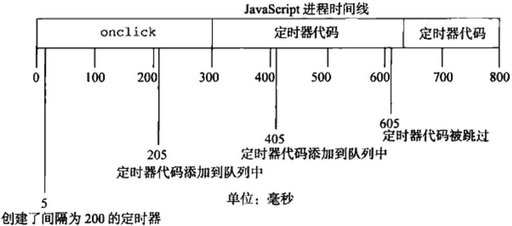

## 关于最小延迟
"setTimeout的最短时间间隔是4毫秒；setInterval的最短间隔时间是10毫秒，也就是说，小于10毫秒的时间间隔会被调整到10毫秒"

所以说，定时器其实并不严谨定时。导致延时的原因常包括。

### 原因一，事件队列阻塞
依据浏览器的事件处理机制，setTimeout 和 setIntervel在到达定时的那一刻将回调压入事件队列中，如果此时队列的前方还有正在执行的任务，则会阻塞定时器的回调执行。

### 原因二，浏览器的节能限制
为了节省CPU资源，一些浏览器会在用户切换tab时，对不在激活状态的tab的作了节流限制，把定时最小延迟从>=4ms提升至>=1000ms。

## 关于setIntervel的问题
除了在某些浏览器下setIntervel的延迟有可能比setTimeout要高外，setIntervel还存在一些问题。

当使用setInterval()时，JS引擎会判断事件队列中是否还有该定时器的回调，若无，才将定时器回调压入事件队列，若有，则这个间隔不向事件队列压入回调。


<br/>

假设，某个onclick事件处理程序使用setInterval()设置了200ms间隔的定时器。如果事件处理程序花了300ms多一点时间完成，同时定时器代码也花了差不多的时间，就会同时出现跳过某间隔的情况。

## 更好地应用定时器

### 使用setTimeout 代替 setIntervel
```javascript
var timer;
function run(){
    timer = setTimeout(run, duration);
}

// kick off
run();

// stop intervel
clearTimeout(timer);
```

### 使用postMessage实现0ms延时
[参考David Baron的博文与Demo](https://dbaron.org/log/20100309-faster-timeouts)

### 使用RAF + 系统时间来实现精确的时钟
setIntervel是不精确的，可以使用RAF每帧去刷新获取当前系统时间new Date().getTime()并更新当前时间。

## RequestAnimationFrame
### 实现平滑动画的要素
帧率表示在1秒内视觉内容刷新的次数，单位fps。
如60fps，表示1秒内刷新60次。（即1000ms/60 = 约16.6ms刷新一次）

过去，定时器一直运用在动画中，设置的延迟时间需要跟上帧率，动画才会更加流畅。鉴于大多数显示器的刷新频率是60Hz，因此最佳的间隔是16.6ms。

然而，定时器的通病是精确度，使用定时器设置动画时，浏览器是被告知式地在整个视图重绘的同时去渲染动画的，如果使用定时器为动画设置的帧率与屏幕的刷新率不同步，就会消耗更多的CPU资源。RequestAnimationFrame正是为了解决这一痛点而诞生。

```javascript
var raf;
function run(){
    timer = requestAnimationFrame(draw);
}

// kick off
run();

// stop raf
cancleAnimationFrame(raf);
```

### requestAnimationFrame为什么更好

* RAF会把每一帧中的所有DOM操作集中起来，在一次重绘或回流中就完成。
* 并且重绘或回流的时间间隔紧跟浏览器的刷新频率（一般是60fps）。
* 在隐藏或不可见的元素中，requestAnimationFrame将不会进行重绘或回流。
* 上述RAF所创造的条件能有效地节省了CPU和GPU资源。

### 兼容性与pollyfill
[caniuse-requestAnimationFrame](https://caniuse.com/?search=requestAnimationFrame)
注意IE10以下以及OperaMini暂不支持RAF，可以使用setTimeout并检测回调之间的执行时间差来做pollyfill。
```javascript
// http://paulirish.com/2011/requestanimationframe-for-smart-animating/
// http://my.opera.com/emoller/blog/2011/12/20/requestanimationframe-for-smart-er-animating
 
// requestAnimationFrame polyfill by Erik Möller
// fixes from Paul Irish and Tino Zijdel
 
(function() {
    var lastTime = 0;
    var vendors = ['ms', 'moz', 'webkit', 'o'];
    for(var x = 0; x < vendors.length && !window.requestAnimationFrame; ++x) {
        window.requestAnimationFrame = window[vendors[x]+'RequestAnimationFrame'];
        window.cancelAnimationFrame = window[vendors[x]+'CancelAnimationFrame']
                                   || window[vendors[x]+'CancelRequestAnimationFrame'];
    }
 
    if (!window.requestAnimationFrame)
        window.requestAnimationFrame = function(callback, element) {
            var currTime = new Date().getTime();
            var timeToCall = Math.max(0, 16 - (currTime - lastTime));
            var id = window.setTimeout(function() { callback(currTime + timeToCall); },
              timeToCall);
            lastTime = currTime + timeToCall;
            return id;
        };
 
    if (!window.cancelAnimationFrame)
        window.cancelAnimationFrame = function(id) {
            clearTimeout(id);
        };
}());
```


## 参考
[深入理解定时器系列（一）](https://www.cnblogs.com/xiaohuochai/p/5773183.html)
[深入理解定时器系列（二）](https://www.cnblogs.com/xiaohuochai/p/5777186.html)
[深入理解定时器系列（三）](https://www.cnblogs.com/xiaohuochai/p/5777757.html)
[Using requestAnimationFrame](https://css-tricks.com/using-requestanimationframe/)
[The secret of requestAnimationFrame](http://creativejs.com/resources/requestanimationframe/)