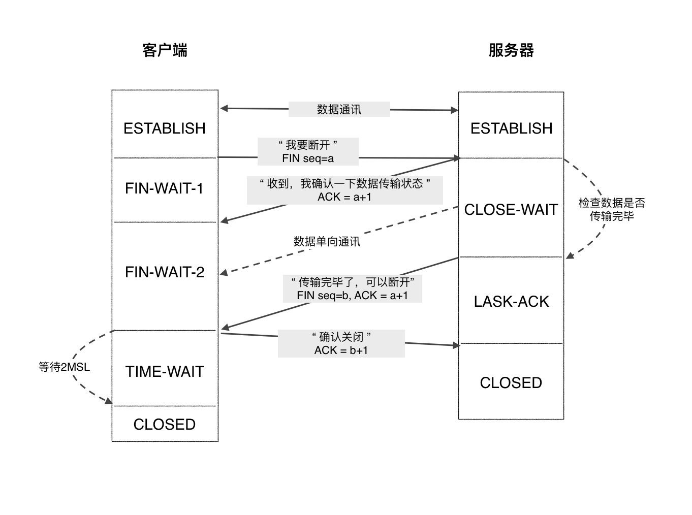

## TCP
面向连接的，可靠的，传输控制协议。（Transmission Control Protocol）

* 类似于打电话，必须建立可靠连接后才能收发数据
* 特点：
    * 必须建立点对点的链接

* 优点：
    * 收发数据稳定，不容易丢包
    * 失败重传机制
    * 拥塞控制机制

* 缺点：（必须建立连接不可避免的缺陷）
    * 速度慢、效率低
    * 比较消耗cpu资源
    * 容易被攻击（容易受DOS、DDOS类型的攻击，如SYN Flood攻击）

* 应用场景：
    * 追求传输稳定、可靠
    * 如，HTTP请求、FTP文件传输、邮件收发

### 连接：三次握手

#### 三次握手的前置知识：
* 握手时传递的信号：
    * SYN（同步码）
    * ACK（确认码）
* 状态：
    * LISTEN：（服务器）侦听TCP端口中..等待连接请求
    * SYN_SENT：（客户端）连接请求已发送...等待回复
    * SYN_RECEIVED：（服务器）已收到连接请求...确认连接吗...等待回复
    * ESTABLISHED：（客户端，服务器）连接已建立

#### 流程图

 

#### 流程解释
1. 服务器侦听来自客户端的连接请求，处于LISTEN状态。

2. 客户端发送连接请求（发送同步码SYN），进入SYN_SENT状态

3. 服务器收到请求并确认（发送确认码ACK，及同步码SYN），进入SYN_RECEIVED状态

4. 客户端收到确认码，建立连接（发送确认码ACK）,进入ESTABLISHED状态

5. 服务器收到确认码，建立连接，进入ESTABLISHED状态

#### 为什么不是两次握手

答：仅靠两次握手，服务器此时无法确定客户端是否还需要连接，若此时客户端已经不需要连接，那么继续连接是无意义的。

#### SYN Flood

* SYN Flood 属于典型的 DoS/DDoS 攻击。
* 攻击原理：
    * 用客户端伪造大量不存在IP地址，疯狂地向服务器发起请求。
    * 这将占满了服务器的半连接池，并导致服务器不断重复向这些IP发出ack信号，以企望客户端应答。
* 防御手段：
    * 增加半连接池容量
    * 减少重发信号的次数
    
### 断开：四次挥手
* 挥手时传递的信号：
    * FIN（结束码）
    * ACK（确认码）
* 状态：
    * FIN_WAIT_1：（客户端）发出关闭请求，等待被确认
    * FIN_WAIT_2：（客户端）收到首次确认，等待二次确认
    * CLOSE_WAIT：（服务器）等待数据传输结束
    * LAST_ACK：（服务器）发出关闭请求，等待被确认
    * TIME_WAIT：（客户端）等待足够长的时间，确保服务器收到确认断开
    * CLOSED：（服务器，客户端）连接关闭

#### 流程图

 

#### 流程解释
1. 客户端发送关闭请求（发送结束码FIN），进入FIN_WAIT_1状态

2. 服务器收到请求，并确认（发送确认码ACK），服务器进入CLOSE_WAIT状态（半连接，半关闭状态，服务器此时还有数据正向客户端传输），客户端进入FIN_WAIT_2状态。

3. 服务器数据传输完毕，发送关闭请求（发送结束码FIN，确认码ACK），进入LAST-ACK状态

4. 客户端收到请求，并确认（发送确认码ACK）,进入TIME-WAIT状态（这个状态延续的时间足够长以确认服务器有没收到最后那个ACK，若真没收到，服务器会重复3流程）

5. 服务器收到确认，先进入CLOSE状态，客户端随后进入CLOSE状态。

#### TIME-WAIT 2 MSL是什么

* MSL(Maximum Segment Lifetime，报文最大生存时间)。

* 客户端最后发送的ACK，到达服务端，时长需要1个MSL。

* 服务端如果没有收到ACK，那么会重新传FIN到达客户端，时长也需要1个MSL。

* 所以第一个MSL是确保ack能传到服务端，第二个MSL是确保故障后能收到重传的FIN信号。

#### 为啥不是三次挥手

答：为确保服务器的数据能完整传输到客户端后再断开连接，所以服务器收到FIN信号后并不会直接应答FIN，而是先确认客户端的关闭信号，检查数据传输是否完成后再应答FIN。

## UDP
面向无连接的，数据报协议。
（ User Data Protocol ）

* 类似于喇叭叫人，不用建立连接就可发出数据  

* 特点：
    * 不建立连接
    * 可一对一，一对多，多对多通信 

* 优点：
    * 快速、实时性较好
    * 漏洞少（UDP flood攻击）

* 缺点：不可靠、不稳定、容易丢包

* 应用场景：
    * 追求实时性、追求传输效率
    * 如，QQ对话、语音、直播
