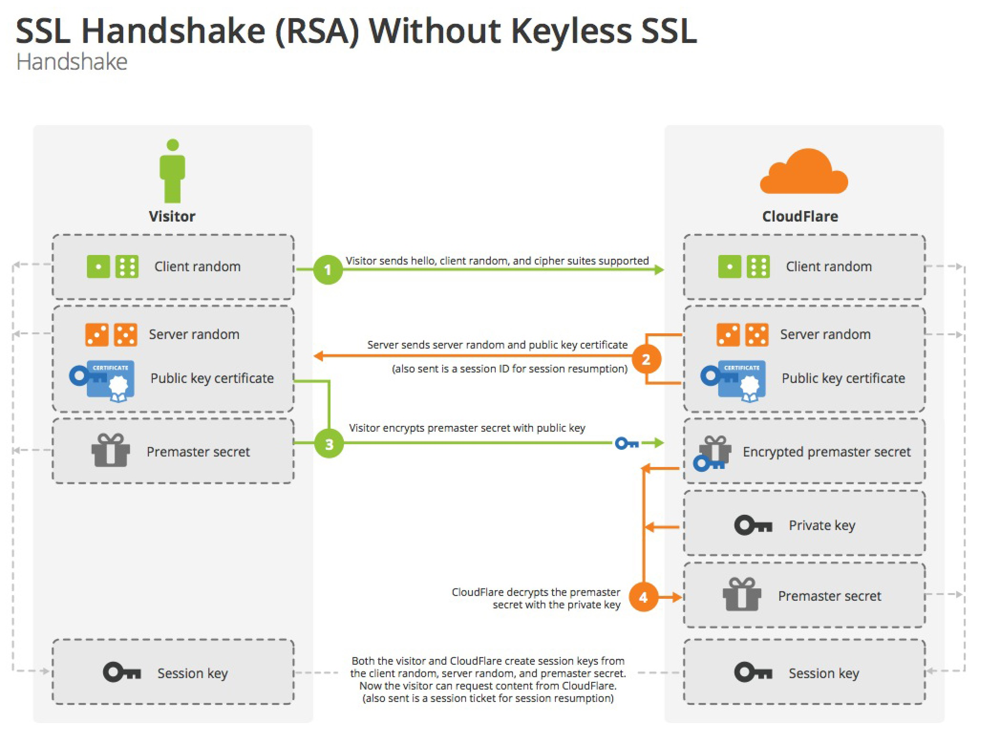

## SSL/TLS 协议

### 定义

* SSL：安全套接字协议，Secure Sockets Layer
* TLS：传输安全层协议，Transport Layer Security
* SSL/TLS：是以上两个协议的组合使用

他们位于OSI模型的传输层和应用层之间，都是数据加密协议，在网络传输中起保护通讯安全作用。最突出的应用场景就是HTTPS。

### SSL/TLS为HTTP解决了什么问题

HTTP协议通信，所有信息都是明文传输的，是不安全的。SSL/TLS都一一给出了解决方案：

1. 窃听风险：第三方可窃听通信内容，而SSL/TLS进行了信息加密

2. 篡改风险：第三方可以篡改通信内容，而SSL/TLS建立了校验机制，可判断信息是否被篡改

3. 冒充风险：第三方可冒充服务器进行通信，二SSL/TLS配备身份证书，防止身份冒充。

### SSL/TLS的基本原理

#### 非对称加密 + 对称加密

1. 客户端向服务器索要公钥（非对称加密）。

2. 客户端接收到后，生成一个“对话密钥”，使用公钥加密“对话密钥”并发送给服务器。

3. 服务器使用私钥，解密出“对话密钥”。

3. 随后客户端和服务器间的任何通信都使用“对话密钥”进行加密和解密（对称加密）。

#### SSL握手
 

 

#### 如何保证服务器发送的公钥不被篡改？

公钥是放在数字证书中一并发给客户端的。只要保证数字证书没有被篡改就能保证公钥没有被篡改。
（数字证书是一个权威机构使用CA私钥进行签名的，而大家的操作系统中也都存在该权威机构的公钥，因此可以解析并验证数字证书，是否真实且没有被篡改）

**那么，第三方攻击者能否伪造出证书？**

答：没法，权威机构需要域名信息、管理邮箱等能够证明你是该域名的拥有者，才签发证书。

#### 为何要组合两种加密方式

答：非对称加密方式确保“对话密钥”不会被窃取，对称加密方式保证了通讯效率。

### 参考
[阮一峰，图解SSL/TLS协议](http://www.ruanyifeng.com/blog/2014/09/illustration-ssl.html)
[阮一峰，SSL/TLS协议运行机制的概述](http://www.ruanyifeng.com/blog/2014/02/ssl_tls.html)