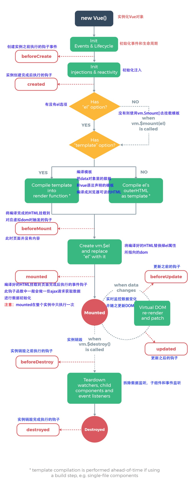
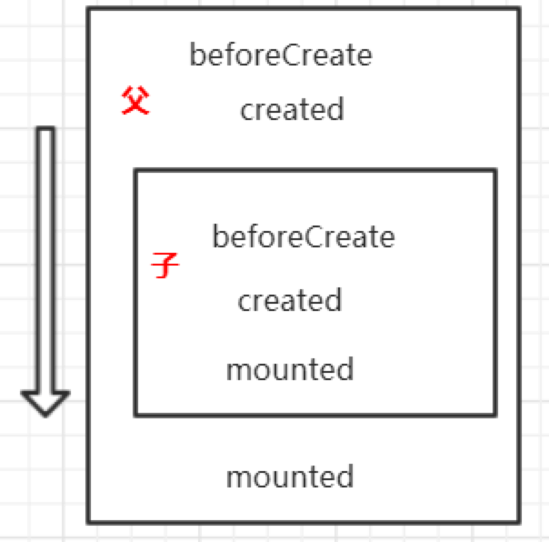

## 生命周期图注解


## 初始化阶段

我们通过new来实例化一个Vue对象，完成后调用beforeCreate钩子函数，

紧接着Vue会观察传入的配置，并为我们刚才实例化的vue对象注入data、methods、watcher等对象和函数对象，执行creted钩子函数，（此时可以访问到实例对象上的data、computed、methods、watch对象，但访问不到$el属性。）

接着，会观察配置对象中是否存在el选择器选项，如果没有的话，从此就会跳出生命周期，直到我们主动地去调用实例对象上的mount方法进行手动挂载。如果存在el选择器选项，编译器会优先选择template模板进行编译，编译的结果在内存中以虚拟DOM的形式存在，完成编译后执行beforeMount钩子函数，此时$el属性注入到vue实例对象，已经可以访问（存异，此处测试未证实，仍要等到mounted才能读取到$el），但是页面上还没有内容。

紧接着会将编译从内存中取出虚拟DOM对象进行DOM替换，有初始值的话会进行列表渲染和数据注入，完成挂载，View视图也完整呈现，并调用mounted。

这四个阶段为Vue的初始化阶段，beforeCreate、created、beforeMount、mounted这四个钩子函数也只会执行一次。

在created、beforeMount、mounted就可以进行AJAX请求和启动定时器等异步任务，而在mounted阶段才会考虑进行真实DOM的一些操作。
(记录..在此阶段才能得到refs)

* * *
## 数据监听与更新阶段
当实例对象完成挂载之后，分线程中会预留着数据监听器，当一些交互操作使数据发生改变后，watcher会捕获这些变化并进行缓冲计算把data变化结果，vue异步执行DOM更新,从而完成View视图更改。更新之前调用beforeUpdate钩子函数，完成视图更新后调用updated钩子函数。这个阶段是可多次重复执行的。beforeUpdate适合在更新之前访问现有的DOM，进行拆除事件监听和定时器。应避免在updated中操作数据，有陷入死循环的风险

* * *
## 销毁阶段
当关闭页面、v-if为false、或者主动调用vm.$destroy时将会销毁实例对象，befroeDestroy钩子函数在销毁之前调用，此刻实例仍然是可以使用的，destroyed钩子函数在Vue实例销毁之后调用，此时Vue实例解除与DOM的绑定、事件监听器和子实例都会销毁，虽然DOM节点仍旧存在，但修改数据dom已经没有响应，如果要清除DOM,需要手动去调用以下方法
```
this.$el.parentNode.removeChild(this.$el);
```
。而一般会在beforeDestroy进行一些监听器、定时器、插件对象手动销毁。


* * *
## 关于vm.nextTick()
在下次DOM更新循环结束之后执行的回调，即在updated之后，通过这个方法可以在created中进行DOM操作，也可以通过nextTick对异步函数的结果进行操作，详看第二条链接。

* * *
## 关于父子组件的生命周期关系
<br/>

<br/>


* 父组件先创建后挂载（在这里获取全局组件的参数）
* 父组件先准备销毁后销毁

父beforeCreate->父created->父beforeMount->子beforeCreate->子created->子beforeMount->子mounted->父mounted

父beforeUpdate->子beforeUpdate->子updated->父updated

父beforeDestroy->子beforeDestroy->子destroyed->父destroyed